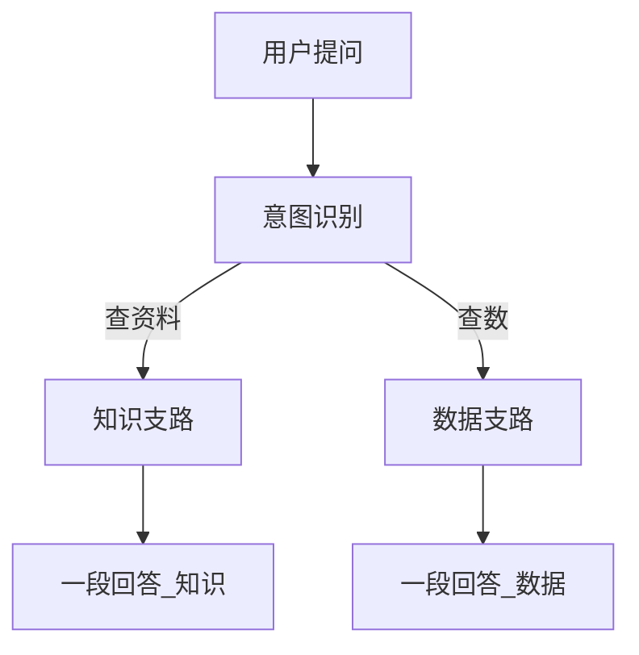

# 单边意图分流：工作流配置（售后助手）

## 1. 要达到的效果（业务侧）

- 用户**每次只提一个问题**。
- 系统先判断：这个问题更像**查资料（政策、步骤、故障说明）**，还是**查工单数据（数量、排名、筛选）**。
- **只走其中一条路**，最后给用户**一段完整回答**；默认不把「知识库 + 数据库」两段硬拼在同一条回复里（与你定的「多数单边」一致）。

## 2. 整体流程（概念）

## 3. 在 MaxKB 工作流里怎么搭（操作顺序）

以下节点名称以 **中文界面** 为准（与产品内「工作流」画布一致）。

1. **开始**：接收用户问题（默认已有）。
2. **意图识别**：放在开始之后。  
   - 预先配置 **两类意图**（名称可自定，建议语义清晰）：  
     - **查知识**：政策、SOP、安装说明、故障现象解释、保修规则等。  
     - **查数据**：多少条、占比、按地区/状态统计、TopN、某时间段工单量等。  
   - 可为每一类各写 **几条典型例句**，帮助匹配更稳。  
   - **「其他」或匹配不上**：建议默认归到 **查知识**（避免误触数据库）；若你希望默认拒答或提示重问，也可在知识支路用「指定回复」说明。
3. **查知识** 分支后面：接 **知识库检索** 或 **文档检索**（择一或组合，按你实际导入方式），再接 **AI 对话** 节点，根据检索结果组织成自然语言回答。
4. **查数据** 分支后面：按 [04_Text2SQL_工具与工作流说明.md](./04_Text2SQL_工具与工作流说明.md) 中的链路配置：**AI 生成 SQL → 自定义工具执行 →（建议）再 AI 把结果说成业务话**。
5. 两条分支最后都接到 **结束**（或各自独立的回复出口，视你使用的应用类型而定），保证用户始终只收到**当前支路**生成的那一段主回复。

> 若你更习惯不用「意图识别」节点，也可用 **「AI 对话」只做分类**（严格要求只输出 `KNOWLEDGE` 或 `DATA` 两个单词之一）+ **判断器** 分支；效果类似，维护成本略高。

## 4. 意图怎么写才好用（举例）

| 意图名称 | 典型用户说法（示例） |
|----------|----------------------|
| 查知识 | 「E101 是什么意思」「保修几年」「首次校准步骤」「升级流程」 |
| 查数据 | 「华东有多少未关闭工单」「4 月工单总量」「故障类型前三名」「张涛处理了多少单」 |

边界不清时（例如「E101 多吗」）：可归 **查数据**（统计）或 **查知识**（解释码）；**只选一边**，并在提示词里写清你的偏好（建议：**偏统计走查数据，偏含义走查知识**）。

## 5. 与 Text2SQL 文档的关系

- **数据支路**的详细表结构、工具粘贴、安全规则：见 [04_Text2SQL_工具与工作流说明.md](./04_Text2SQL_工具与工作流说明.md)。  
- **回归用例**（数据问法）：见 [05_Text2SQL回归问题.md](./05_Text2SQL回归问题.md)。

## 6. 上线前自检（业务清单）

- [ ] 随机抽 5 条「明显查资料」的问法，是否都**只**走知识支路、且**不**调数据库工具。  
- [ ] 随机抽 5 条「明显查数」的问法，是否都**只**走数据支路、且回答与演示数据大致一致。  
- [ ] 故意问一句模糊话，行为是否符合你在第 4 节定的规则（默认走哪边）。
